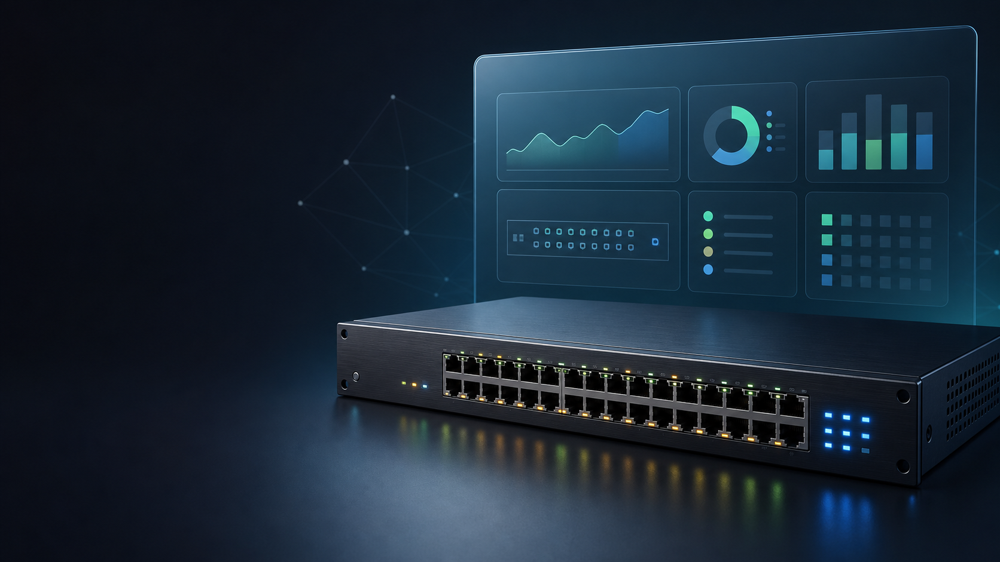

# UniFi Vision



Live UniFi switch faceplates for Home Assistant.

UniFi Vision polls a UniFi Network controller, publishes switch and per-port
state through Home Assistant MQTT discovery, and renders the data as a custom
Lovelace card. The poller and card are intentionally small: Python on the
backend and one dependency-free JavaScript file on the dashboard.

This is a community project and is not affiliated with Ubiquiti or Home
Assistant.

## Features

- Automatic Home Assistant entity creation through MQTT discovery
- Link state, negotiated speed, traffic, duplex, media type, and PoE draw per port
- Animated traffic LEDs with stale and offline states
- Model-specific layouts for `US24P250`, `US8P150`, `US8P60`, `USF5P`,
  `USL16LP`, and `UDMPRO`
- Generic two-row fallback for unknown switch models
- Read-only UniFi statistics polling with retry and exponential backoff
- No frontend build step or external card dependencies

## Architecture

```text
UniFi Network controller -> Python poller -> MQTT -> Home Assistant
                                                     |
                                                     v
                                           Lovelace switch card
```

## Requirements

- A UniFi OS console/controller reachable from the poller
- A local UniFi account that can read Network application data
- An MQTT broker connected to Home Assistant
- Home Assistant MQTT discovery enabled
- Docker with Compose, or Python 3.12+

## Quick start with Docker Compose

1. Copy the example configuration and replace every placeholder:

   ```bash
   cp .env.example .env
   ```

2. Start the poller:

   ```bash
   docker compose up -d --build
   docker compose logs -f unifi-vision
   ```

3. Confirm that entities such as `sensor.unifi_vision_core_switch` appear in
   Home Assistant.

An empty `SWITCH_MACS` value publishes every UniFi `usw` and `udm` device.
Set it to a comma-separated MAC allowlist to publish only selected switches.

## Install the Lovelace card

1. Copy [`card/unifi-switch-card.js`](card/unifi-switch-card.js) to:

   ```text
   /config/www/unifi-vision/unifi-switch-card.js
   ```

2. In Home Assistant, open **Settings -> Dashboards -> Resources** and add:

   ```text
   /local/unifi-vision/unifi-switch-card.js?v=1
   ```

   Select **JavaScript module** as the resource type.

3. Add a card to a dashboard:

   ```yaml
   type: custom:unifi-switch-card
   entity: sensor.unifi_vision_core_switch
   title: Core Switch
   show_poe: true
   led_mode: auto
   ```

See [`deploy/lovelace-resource.md`](deploy/lovelace-resource.md) for deployment
and cache-busting details, and [`deploy/network-view.yaml`](deploy/network-view.yaml)
for a complete example view.

## Configuration

| Variable | Required | Default | Description |
|---|---:|---|---|
| `UNIFI_HOST` | No | `https://192.168.1.1` | UniFi OS console URL |
| `UNIFI_USER` | Yes | - | Local UniFi username |
| `UNIFI_PASS` | Yes | - | Local UniFi password |
| `UNIFI_SITE` | No | `default` | Network application site name |
| `MQTT_HOST` | Yes | - | MQTT broker hostname or IP |
| `MQTT_PORT` | No | `1883` | MQTT broker port |
| `MQTT_USER` | Yes | - | MQTT username |
| `MQTT_PASS` | Yes | - | MQTT password |
| `SWITCH_MACS` | No | all switches | Comma-separated switch MAC allowlist |
| `POLL_SEC` | No | `5` | Poll interval in seconds |
| `DISCOVERY_PREFIX` | No | `homeassistant` | MQTT discovery prefix |
| `STATE_PREFIX` | No | `unifi-vision` | MQTT state topic prefix |

## Development

```bash
python -m venv .venv
source .venv/bin/activate
pip install -r requirements.txt
pytest -q
```

To preview the card without Home Assistant:

```bash
cd card
python -m http.server 8930
```

Then open `http://localhost:8930/dev-preview.html`.

## Security notes

- Keep `.env` out of version control. It is ignored by both Git and Docker.
- Use a dedicated UniFi account with the minimum permissions available.
- The current controller client accepts self-signed certificates and does not
  verify TLS. MQTT transport is also not TLS-enabled by this application.
  Run the poller only on a trusted LAN or through a private network/VPN.
- The poller reads switch statistics; it does not expose a listening port or
  call UniFi configuration endpoints.

## License

This project is licensed under the MIT License. See [LICENSE](LICENSE).
