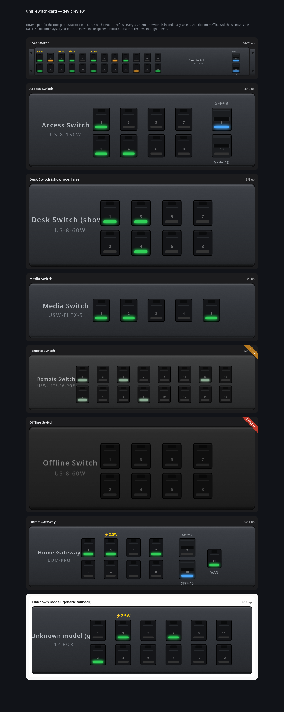

# UniFi Vision

Live UniFi switch faceplates for Home Assistant.

UniFi Vision polls a UniFi Network controller, publishes switch and per-port
state through MQTT discovery, and renders the data as a custom Lovelace card.
The poller and card are intentionally small: Python on the backend and one
dependency-free JavaScript file in the dashboard.

This is a community project and is not affiliated with Ubiquiti or Home
Assistant.

## What this does

This project connects four things:

~~~text
Your UniFi controller -> UniFi Vision poller -> MQTT broker -> Home Assistant
                                                               |
                                                               v
                                                    Lovelace switch cards
~~~

The UniFi controller provides the live data. The poller reads it and sends it
to MQTT. Home Assistant creates sensor entities from that data. The Lovelace
card draws the switch faceplate in the browser.

You do **not** need Claude Code, an AI service, or a separate image download.
The SVG renderer is already included in this repository.

## Beginner installation

Follow these steps in order. You do not need to change settings on each
physical switch.

### Before you start

You need:

- A UniFi console/controller running the Network application
- A computer or server that can reach the UniFi controller and run Docker
- Home Assistant with an MQTT broker
- A local UniFi account that can read Network application data
- An MQTT username and password

The poller can run on the same machine as Home Assistant or on another machine.
It only needs network access to both the UniFi controller and MQTT broker.

### Step 1: Prepare Home Assistant MQTT

If MQTT is already working in Home Assistant, skip this step.

Otherwise:

1. In Home Assistant, open **Settings -> Add-ons -> Add-on store**.
2. Install and start the **Mosquitto broker** add-on.
3. Add an MQTT login in the broker configuration.
4. In Home Assistant, open **Settings -> Devices & services**.
5. Add or configure the **MQTT** integration and confirm it connects to the broker.

MQTT discovery must be enabled. The broker can run on Home Assistant, but the
poller must use the Home Assistant machine's LAN IP as MQTT_HOST; do not use
localhost from inside the Docker container.

### Step 2: Create a UniFi read-only account

In the UniFi Network/UniFi OS administration interface, create a dedicated
local account for this project. Give it permission to read Network application
data. Do not use your personal administrator password if a separate account is
available.

UniFi menu names vary between UniFi OS versions. The account must be a local
account that can log in to the controller's local API.

You will need:

- The controller URL, such as https://192.168.1.1
- The UniFi username
- The UniFi password
- The site name, usually default

No firmware changes, per-switch MQTT setup, or port configuration are needed.

### Step 3: Download the project

On the machine that will run the poller:

~~~bash
git clone https://github.com/robomello/unifi-vision.git
cd unifi-vision
~~~

Docker and Docker Compose must be installed on that machine.

### Step 4: Fill in the configuration

Copy the example file:

~~~bash
cp .env.example .env
~~~

Open .env in a text editor and replace the placeholders:

~~~dotenv
# UniFi controller
UNIFI_HOST=https://192.168.1.1
UNIFI_USER=unifi-vision-readonly
UNIFI_PASS=replace-with-your-unifi-password
UNIFI_SITE=default

# MQTT broker
# Use the Home Assistant LAN IP if Mosquitto runs inside Home Assistant.
MQTT_HOST=192.168.1.50
MQTT_PORT=1883
MQTT_USER=unifi-vision
MQTT_PASS=replace-with-your-mqtt-password

# Leave empty to monitor every UniFi switch and UDM.
SWITCH_MACS=
POLL_SEC=5
DISCOVERY_PREFIX=homeassistant
STATE_PREFIX=unifi-vision
~~~

Keep .env private. Never commit it or paste its contents into an issue.

### Step 5: Start the poller

From the project directory:

~~~bash
docker compose up -d --build
docker compose logs -f unifi-vision
~~~

A healthy startup shows the poller connecting to MQTT and the UniFi
controller. If it cannot connect, it retries with increasing delays.

### Step 6: Confirm that Home Assistant discovered the switches

In Home Assistant:

1. Open **Developer tools -> States**.
2. Search for **sensor.unifi_vision_**.
3. You should see one sensor for each discovered switch.

The entity name is based on the switch name in UniFi. For example, a switch
named "Core Switch" usually becomes:

~~~text
sensor.unifi_vision_core_switch
~~~

If no entities appear, check the poller logs, the UniFi credentials, the
MQTT credentials, the broker address, and that MQTT discovery is enabled.

### Step 7: Install the Lovelace card

The poller creates the data entities, but Home Assistant still needs the
JavaScript card that displays them.

Copy card/unifi-switch-card.js into the Home Assistant configuration directory:

~~~text
/config/www/unifi-vision/unifi-switch-card.js
~~~

You can copy it using the Home Assistant File editor, Samba, SSH, or another
file-transfer method. Create the www/unifi-vision folders if necessary.

Then register the file:

1. Open **Settings -> Dashboards**.
2. Open the three-dot menu and choose **Resources**.
3. Choose **Add resource**.
4. Enter:

   ~~~text
   /local/unifi-vision/unifi-switch-card.js?v=1
   ~~~

5. Select **JavaScript module**.
6. Save and refresh the browser.

### Step 8: Add cards to a dashboard

Add one card for each entity you want to display:

~~~yaml
type: custom:unifi-switch-card
entity: sensor.unifi_vision_core_switch
title: Core Switch
show_poe: true
led_mode: auto
~~~

The repository includes an example view in
deploy/network-view.yaml. Open its raw contents, paste them into a dashboard
view, and replace the example entity IDs with the entities from your own
Home Assistant installation.

If you see **Custom element doesn't exist**, the JavaScript resource is not
registered or the browser is using an old cached version. Recheck the resource
URL and increase ?v=1 to ?v=2 after each replacement.

### Step 9: Confirm live updates

Turn a device or cable on and off, or watch a busy port. Within the polling
interval, the card should update:

- port up/down state
- negotiated link speed
- traffic LEDs
- PoE wattage
- stale/offline status

The card uses the model code reported by UniFi. Known models get exact
faceplate geometry; unknown models still get a generic layout based on their
port count.

## Configuration reference

| Variable | Required | Default | Description |
|---|---:|---|---|
| UNIFI_HOST | No | https://192.168.1.1 | UniFi OS console URL |
| UNIFI_USER | Yes | - | Local UniFi username |
| UNIFI_PASS | Yes | - | Local UniFi password |
| UNIFI_SITE | No | default | Network application site name |
| MQTT_HOST | Yes | - | MQTT broker hostname or IP |
| MQTT_PORT | No | 1883 | MQTT broker port |
| MQTT_USER | Yes | - | MQTT username |
| MQTT_PASS | Yes | - | MQTT password |
| SWITCH_MACS | No | all switches | Comma-separated switch MAC allowlist |
| POLL_SEC | No | 5 | Poll interval in seconds |
| DISCOVERY_PREFIX | No | homeassistant | MQTT discovery prefix |
| STATE_PREFIX | No | unifi-vision | MQTT state topic prefix |

An empty SWITCH_MACS value monitors every UniFi usw and udm device. Use a
comma-separated MAC allowlist when you want only selected switches.

## Troubleshooting

### The poller keeps retrying

Run:

~~~bash
docker compose logs -f unifi-vision
~~~

Check that:

- UNIFI_HOST is reachable from the poller machine
- the UniFi account is a local account with Network read access
- MQTT_HOST is the broker LAN address, not container-local localhost
- the MQTT username and password are correct
- the Docker host can reach both services

### Home Assistant has no new entities

Check the poller logs first. Then confirm that the MQTT integration is
connected and MQTT discovery is enabled. Restarting the poller republishes
retained discovery configuration.

### The card is gray or says stale/offline

The card is not receiving fresh MQTT data. Check the poller logs and confirm
that the UniFi controller and broker are reachable.

### The card appears but the layout is generic

The switch model code is not yet in the exact geometry registry. The card still
works using a generic port layout. Add a model-specific geometry entry if an
exact faceplate is important.

## Development

~~~bash
python -m venv .venv
source .venv/bin/activate
pip install -r requirements.txt
pytest -q
~~~

To preview the card without Home Assistant:

~~~bash
cd card
python -m http.server 8930
~~~

Then open http://localhost:8930/dev-preview.html.

## Security notes

- Keep .env out of version control. It is ignored by both Git and Docker.
- Use a dedicated UniFi account with the minimum permissions available.
- The current controller client accepts self-signed certificates and does not
  verify TLS. MQTT transport is also not TLS-enabled by this application.
  Run the poller only on a trusted LAN or through a private network/VPN.
- The poller reads switch statistics; it does not expose a listening port or
  call UniFi configuration endpoints.

## License

This project is licensed under the MIT License. See LICENSE.
